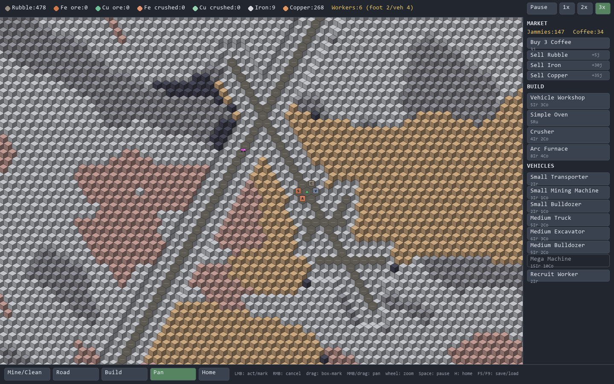

# Andes — a chill hex mining game

[](https://github.com/nathmo/Andes_Miner/actions/workflows/build.yml)

You are the **Overseer**: a camera over an endless Andean slope. Mark rock for
mining, and your workers dig it out, haul the ore home, clear rubble, and lay
roads. Refine ore into metal, build a vehicle workshop, and grow from three
workers with hand tools into a fleet of mining machines. 
As you reach villages, connect them together with a road network while keeping an eye on your CO2 emmission by switching to renewable energy.



the game is inspired by a blend of **Lego Rock Raiders** (dig, haul, vehicles) and **Factorio** (processing, production graph). Built in plain Python with **pygame-ce**.

## Controls
you can do everything via point and click but if you do get hooked and want to be more efficient : 
- **Excavate tool** (`M`) — LMB marks rock for mining (within your machines'
  reach of a road); drag to box-mark many. With a **Mining Planner** built,
  box-selecting ore beyond reach auto-plans the dig + road corridor out to it.
  RMB cancels.
- **Clean tool** (`C`) — LMB (or drag) marks rubble for clearing; a worker or
  bulldozer hauls it off, leaving excavated floor. RMB cancels.
- **Road tool** (`R`) — LMB (or drag) plans road on excavated tiles; a builder
  carries rubble to the site and lays it.
- **Right panel tabs** — the side panel is split into **Build** (place buildings),
  **Fleet** (manufacture vehicles, recruit workers), and **Trade** (buy coffee,
  sell/buy materials). Picking the Build tool jumps to the Build tab; the wheel
  scrolls a tab if its list is taller than the panel. Your jammies and coffee
  always show in the top bar.
- **Build** — pick a building on the Build tab and LMB to place it (no separate
  Build button in the bottom bar; the Build tab drives it).
- **Market button** — live prices, trend sparklines, grid carbon + emissions graph.
- **Settings button** — toggle sky ambiance (clouds, condors) on or off.
- **Pan tool / MMB / drag** — pan. **WASD / arrows** also pan. **Wheel** zooms.
- **Home button / H** — recenter the view on HQ so panning can't lose you.
- **Hover any tile** — the info box names it (e.g. "Diorite rubble", "Excavated
  basalt"), shows hardness and what solid rock drops, mining range, and any piles
  sitting on it.
- **Click a building** — opens its panel; toggle it, or set a Warehouse's auto-sell.
- **Space** pause · **1 / 2 / 3** speed · **F5** save · **F9** load/roll-back menu · **Esc** pan tool.


## The bigger game — goal, market, energy
- **Goal.** Villages are scattered across the slope; the objective is to reach and
  link each one to your road network (top bar tracks progress), rewarding lateral
  exploration.
- **Market.** Sell any resource for jammies and buy materials from the **Trade**
  tab — the metals **iron** and **copper** to unblock building when you're
  mining-starved, plus **silicon** and **lithium** you can't make early (needed
  for the better machines). Prices drift on a small stock market: your own trading
  and a random walk move them, floored so you can always raise coffee money.
- **Energy.** Machines draw power. Buy it from the grid (auto, with jammies) or
  build **Solar Arrays** — a full material chain runs rubble → SiO2 → solar panels,
  and lithium (from spodumene via an Electrolysis Plant) feeds **Battery Factories**
  and **Grid Batteries** that store daytime solar for the night. Reinjecting clean surplus lower the grid's carbon intensity for everyone; run out of cash and the
  machines stop (workers keep going until their iced coffee run out). A **day/night cycle** dims the world and sets solar yield. 

## Download & play
CI builds a Windows `.exe`, a Debian/Ubuntu `.deb`, and a macOS `.app` on every
push (see the badge above).
- **Tagged releases** — download a build from the
  [Releases page](https://github.com/nathmo/Andes_Miner/releases). Push a
  `v*` tag (e.g. `v1.0.0`) and the workflow attaches all three there.
- **Latest commit** — the same three artifacts hang off each successful run on
  the [Actions tab](https://github.com/nathmo/Andes_Miner/actions) (open a run →
  *Artifacts*; you must be signed in to GitHub to download them).

Install notes: on Linux `sudo dpkg -i andes_*.deb` then run `andes`. macOS builds
are unsigned, so the first launch needs a right-click → *Open* to clear
Gatekeeper.

## Run (desktop)
```
python -m pip install -r requirements.txt
python main.py
```

## Build for the web (itch.io)
Uses [pygbag](https://pypi.org/project/pygbag/) to compile to WASM. The code is
pure Python with no C extensions, so it ports cleanly.
```
python -m pip install pygbag
python -m pygbag main.py         # serves a local test build at http://localhost:8000
python -m pygbag --build main.py # produces build/web -> zip its contents for itch.io
```

## Build a desktop executable
The [build workflow](.github/workflows/build.yml) does this for all three OSes;
to build locally:
```
python -m pip install pyinstaller
pyinstaller --onefile --windowed --name Andes --add-data "assets;assets" main.py
```
(On macOS/Linux use `--add-data "assets:assets"`; on macOS drop `--onefile` to
get a `.app` bundle.)

## Art
Starter sprites live in `assets/`. They are a mix of google found texture, from scratch MS paint drawn or generated image.

## Tuning
Every number (mining times, ore yields, costs, speeds, colours) lives in
[`config.py`](config.py). Change balance there without touching game logic.